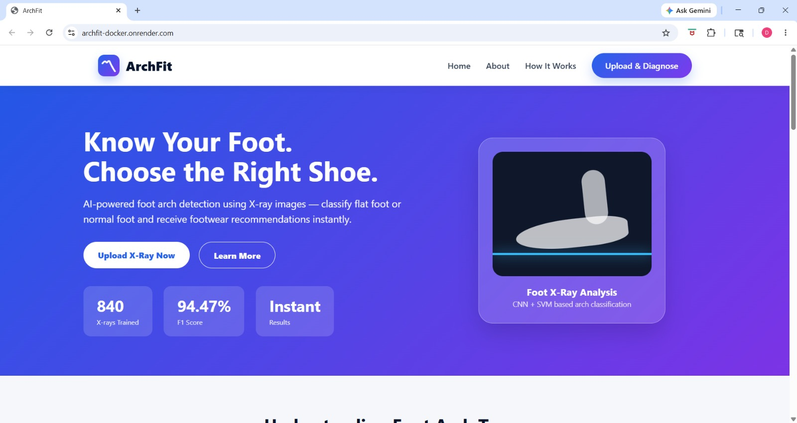
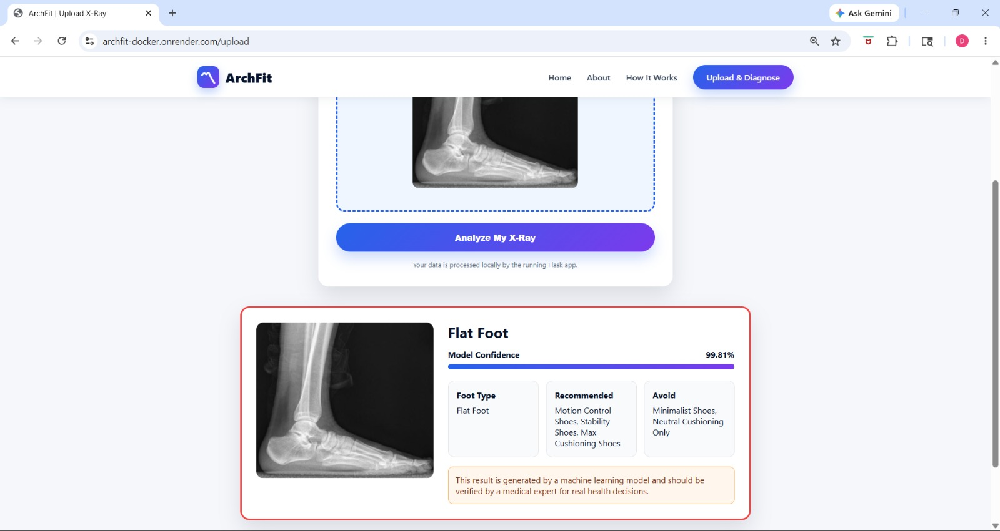

# ArchFit: Foot Arch Classification and Shoe Recommendation System

## Live Demo

🔗 **Live Application:** https://archfit-docker.onrender.com/

---

## Project Overview

ArchFit is an AI-powered web application that classifies foot arch type from lateral foot X-ray images and provides footwear recommendations based on the detected arch structure.

The system identifies whether a foot is:

* Flat Foot (Pes Planus)
* Normal Foot

Based on the classification result, the application recommends suitable footwear categories and highlights footwear types to avoid.

The project combines Deep Learning feature extraction with Machine Learning classification and is deployed as a live web application.

---

## Problem Statement

Flat foot (Pes Planus) is a common condition in which the arch of the foot is reduced or absent. Incorrect footwear selection can worsen discomfort, affect posture, and contribute to knee, ankle, and lower-back issues.

The objective was to develop an automated system capable of:

1. Analyzing foot X-ray images
2. Detecting foot arch type
3. Providing footwear recommendations
4. Making the solution accessible through a web application

---

## Dataset

Dataset Structure:

* pesplanus/
* notpesplanus/

Classes:

1. Pes Planus (Flat Foot)
2. Not Pes Planus (Normal Foot)

The dataset consists of **840 lateral foot X-ray images**:

* 420 Flat Foot images
* 420 Normal Foot images

The balanced dataset helps reduce classification bias and improves model generalization.

---

## Machine Learning Pipeline

### Step 1: Image Preprocessing

* Images loaded using OpenCV
* Resized to MobileNetV2 input dimensions
* Converted to RGB
* Normalized using MobileNetV2 preprocessing

### Step 2: Feature Extraction

**Model Used:** MobileNetV2 (ImageNet Pretrained)

Configuration:

* include_top=False
* Transfer Learning approach
* GlobalAveragePooling2D

Purpose:

Instead of training a CNN from scratch, MobileNetV2 extracts meaningful visual features from foot X-ray images.

### Step 3: Feature Scaling

Technique:

* StandardScaler

Purpose:

* Normalize extracted features
* Improve SVM performance

Saved Model:

* scaler.pkl

### Step 4: Dimensionality Reduction

Technique:

* Principal Component Analysis (PCA)

Purpose:

* Reduce feature dimensions
* Remove redundancy
* Improve training efficiency

Saved Model:

* pca.pkl

### Step 5: Classification

Classifier:

* Support Vector Machine (SVM)

Purpose:

Classify images into:

* Flat Foot
* Normal Foot

Saved Model:

* svm_model.pkl

---

## Final Prediction Workflow

Input X-ray Image

↓

OpenCV Preprocessing

↓

MobileNetV2 Feature Extraction

↓

StandardScaler Transformation

↓

PCA Transformation

↓

SVM Classification

↓

Foot Type Prediction

↓

Footwear Recommendation

---

## Model Performance

| Metric              | Score      |
| ------------------- | ---------- |
| F1 Score            | 94.47%     |
| Classification Type | Binary     |
| Dataset Size        | 840 Images |
| Cross Validation    | 5-Fold     |

The hybrid MobileNetV2 + PCA + SVM architecture achieved strong classification performance while remaining lightweight enough for web deployment.

---

## Recommendation Engine

### Flat Foot

Recommended:

* Motion Control Shoes
* Stability Shoes
* Maximum Cushioning Shoes

Avoid:

* Minimalist Shoes
* Neutral Cushioning Only Shoes

### Normal Foot

Recommended:

* Neutral Running Shoes
* Moderate Cushioning Shoes

Avoid:

* Heavy Motion Control Shoes

---

## Technologies Used

### Machine Learning

* TensorFlow
* MobileNetV2
* Scikit-learn
* SVM
* PCA
* StandardScaler

### Data Processing

* NumPy
* Pandas
* OpenCV
* Joblib

### Backend

* Flask

### Frontend

* HTML
* CSS
* JavaScript

### Deployment

* Docker
* Render

---

## Application Screenshots

### Home Page



### Upload Interface


### Prediction Result



---

## Website Features

### Home Page

Includes:

* Project Introduction
* Foot Arch Education Section
* Flat Foot vs Normal Foot Comparison
* Flat Foot Problems Overview
* Footwear Recommendation Guide
* AI Workflow Explanation

### Upload & Diagnose Page

Features:

* Image Upload Interface
* Image Preview
* File Type Validation (JPG/PNG)
* Loading Spinner During Prediction
* AI-Based Foot Classification
* Confidence Score Display
* Footwear Recommendation Output
* Medical Disclaimer

---

## UI Features

Implemented:

* Responsive Design
* Desktop and Mobile Compatibility
* Modern Landing Page
* Animated Loading Spinner
* Interactive Result Display
* Confidence Progress Bar

---

## Deployment Journey

### Challenge

TensorFlow and MobileNetV2 exceeded Render free-tier memory limits, causing Gunicorn worker termination during deployment.

### Solution

* Dockerized the Flask application
* Created a custom Dockerfile
* Deployed using Docker-based Render services

### Result

Successfully deployed a cloud-hosted AI application capable of performing real-time foot arch classification and shoe recommendation.

---

## Repository Structure

```text
ArchFit/

├── backend/
│   ├── app.py
│   ├── predict.py
│   ├── static/
│   ├── templates/
│   └── uploads/
│
├── models/
│   ├── svm_model.pkl
│   ├── scaler.pkl
│   └── pca.pkl
│
├── screenshots/
│
├── report/
│
├── requirements.txt
├── Dockerfile
├── Procfile
└── README.md
```

---

## Key Learning Outcomes

* Transfer Learning using MobileNetV2
* Medical Image Feature Extraction
* PCA-based Dimensionality Reduction
* SVM Classification
* Flask Web Development
* Frontend and Backend Integration
* Docker Containerization
* Cloud Deployment on Render
* End-to-End Machine Learning Application Development

---

## Future Scope

* Add High Arch classification
* Expand dataset size
* Integrate Grad-CAM explainability
* Personalized shoe recommendation system
* Mobile application deployment

---

## Contributors

* Divyanshu Agwekar
* Puru Bansal

---

## Project Outcome

Successfully developed and deployed a full-stack AI-powered web application that classifies foot arch type from X-ray images and provides footwear recommendations using a hybrid MobileNetV2 + PCA + SVM architecture.
